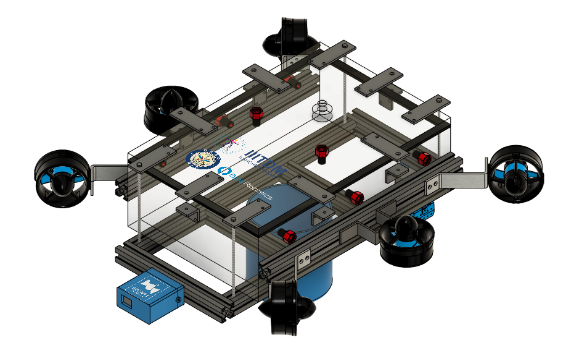

# uwv_description

## About

Contains files and models describing the underwater vehicle and the sensors attached to it. Currently, **vec6** underwater vehicle has been described in this package.

## Underwater Vehicle: vec6

**vec6** is a 6 six thrustered underwater vehicle designed by the AUV Society. It has the following sensors in both simulation and real world:

1. IMU
2. Front facing monocular RGB camera
3. Down facing monocular RGB camera (only in simulation)
4. Depth sensor

| Namespace | Description |
| --- | --- |
| `/vec6` | Top level namespace containing all the topics related to sensor and control data to needed by **vec6** to complete it's tasks. |
| `/vec6/sim_ground_truth` | Topic to which the ground truth values of the simulated `vec6_base_link` are published. |
| `/vec6/sim_depth` | Topic to which simulated depth sensor values are published. |
| `/vec6/sim_imu` | Topic to which simulated IMU values are published. |

 

[Back to parent navigation](../README.md#navigate)